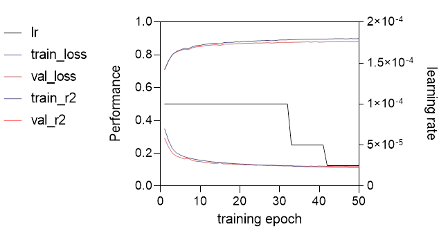
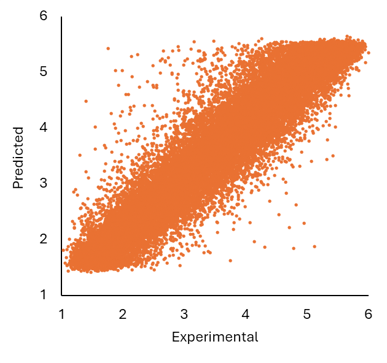
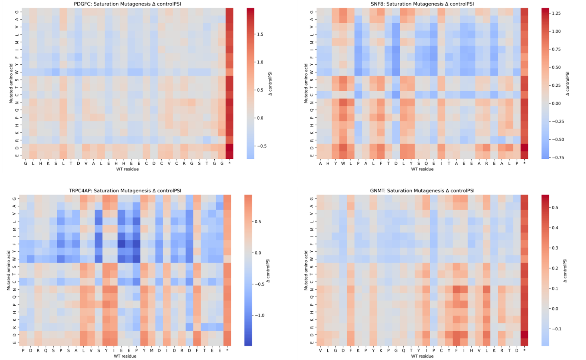

# Degformer

A transformer mode for prediction of protein stability index for
28-residue peptides. Performs better than current composition or
motif-search based methods and is applicable for protein degron mapping
(internal + C-degrons only), *in silico* scanning/saturation mutagenesis
for degron motif detection, and generally stability prediction.

**Training:**

- Uses S1, S4, S7 data from the Elledge lab
  ([doi.org/10.1016/j.molcel.2023.08.022](https://doi.org/10.1016/j.molcel.2023.08.022))

  - S1: 260K peptides from the human proteome

  - S4: Scanning mutagenesis on a subset of degrons

  - S7: Saturation mutagenesis on a subset of degrons

  - For S7, only degrons with \>=60 reads were kept

- 90% of data from each table were selected at random and merged into
  data.csv (569270 sequences)

- The other 10% was kept for final blind testing



- Checkpoints for epoch 30 and 50 saved

**Performance:**

Degformer was tested on data from S1, S4, and S7 that was excluded from
training/evaluation. Predictions from the Elledge lab paper were only
available for S1.

<table style="width:100%;">
<colgroup>
<col style="width: 17%" />
<col style="width: 13%" />
<col style="width: 20%" />
<col style="width: 14%" />
<col style="width: 16%" />
<col style="width: 16%" />
</colgroup>
<thead>
<tr>
<th style="text-align: center;"></th>
<th style="text-align: center;"><strong>Dataset</strong></th>
<th style="text-align: center;"><strong>Correlation (ρ)</strong></th>
<th style="text-align: center;"><strong>Mean ΔPSI</strong></th>
<th style="text-align: center;"><strong>Median ΔPSI</strong></th>
<th style="text-align: center;"><strong>σ(ΔPSI)</strong></th>
</tr>
</thead>
<tbody>
<tr>
<td style="text-align: center;">Elledge lab*</td>
<td style="text-align: center;"><p>S1</p>
<p>S4</p>
<p>S7</p></td>
<td style="text-align: center;"><p>0.8955</p>
<p>-</p>
<p>-</p></td>
<td style="text-align: center;"><p>0.4174</p>
<p>-</p>
<p>-</p></td>
<td style="text-align: center;"><p>0.3179</p>
<p>-</p>
<p>-</p></td>
<td style="text-align: center;"><p>0.5584</p>
<p>-</p>
<p>-</p></td>
</tr>
<tr>
<td style="text-align: center;">Degformer (e30)</td>
<td style="text-align: center;"><p>S1</p>
<p>S4</p>
<p>S7</p></td>
<td style="text-align: center;"><p>0.9409</p>
<p>0.9441</p>
<p>0.9089</p></td>
<td style="text-align: center;"><p>0.3178</p>
<p>0.3065</p>
<p>0.3131</p></td>
<td style="text-align: center;"><p>0.2475</p>
<p>0.2476</p>
<p>0.2240</p></td>
<td style="text-align: center;"><p>0.2873</p>
<p>0.2625</p>
<p>0.3010</p></td>
</tr>
<tr>
<td style="text-align: center;">Degformer (e50)</td>
<td style="text-align: center;"><p>S1</p>
<p>S4</p>
<p>S7</p></td>
<td style="text-align: center;"><p>0.9420</p>
<p>0.9463</p>
<p>0.9162</p></td>
<td style="text-align: center;"><p>0.3148</p>
<p>0.2932</p>
<p>0.3014</p></td>
<td style="text-align: center;"><p>0.2397</p>
<p>0.2322</p>
<p>0.2150</p></td>
<td style="text-align: center;"><p>0.2905</p>
<p>0.2607</p>
<p>0.2923</p></td>
</tr>
</tbody>
</table>

\* Statistics determined from entire 260K dataset for S1 only



**Figure 1:** Performance of Degformer e50 on S1 blind set.

Saturation Mutagenesis:



**Figure 2:** *in silico* saturation mutagenesis recovers diverse degron
motifs.


**Figure 3:** C-degrons are detected by Degformer. Addition of any
residues to the ends of C-degrons stabilizes PDGFC (G-end), SNF8
(P-end), TRPC4AP (EE-end), GNMT (R-3) C-terminals (clockwise from top
left).

Protein degron scanning:


**Figure 4:** Degron scanning of human GNMT.

**Setting up (VSCode):**

1.  Download repository

2.  In VSCode terminal, cd into project folder

3.  Create virtual environment (python -m venv degron-env)

4.  Activate venv (degron-env/scripts/activate). Check that python
    interpreter is using the virtual environment in bottom right corner.

5.  Install dependencies (torch, pandas, numpy, argparse, seaborn,
    matplotlib, etc.)

    1.  If using a GPU make sure the torch package is compatible with
        the architecture (Blackwell =\> cu128)

    2.  For CPU, install CPU-only torch

**Scripts:**

train_v2.py:

- Main training script using built in transformer model training with
  Pytorch

- Model weights stored as .pt

predict.py:

- Main inference script using model weights from train_v2.py

- Provide input .csv file where first column is peptide name, and second
  column is the peptide sequence. Header should be (name, sequence).

Modes:

- **Default:** predicts deltaPSI and controlPSI for peptides

- **Saturation mutagenesis**: predicts PSIs for input peptides, and all
  possible point mutants

- **Scanning mutagenesis:** predicts PSIs for input peptides, with
  scanning point mutation using specified residue (alanine by default)

- **Protein scanning:** provided protein sequence instead of peptide,
  will predict PSI for all possible 28 residue fragments in order
  (overlapping adjacent fragments by 27 residues)

Usage:

- Default prediction
>
> ```python
> python predict.py --input predict_input.csv

- Saturation mutagenesis
>
> ```python
> python predict.py --input predict_input.csv --mode sat_mut

- Scanning mutagenesis (to Alanine)
>
> ```python
> python predict.py --input predict_input.csv --mode scan_mut

- Scanning mutagenesis (to Glycine)
>
> ```python
> python predict.py --input predict_input.csv --mode scan_mut --residue G

- Protein scanning
>
> ```python
> python predict.py --input predict_input.csv --mode protein

- Fragment index for protein mode is based on position of rightmost residue in protein (add 13 or 14 to the index for fragment center format)

saturation_mut_heatmap.py:

- Input .csv should be the output from predict.py or formatted in the same way
>
> ```python
> python saturation_mut_heatmap.py predictions.csv
